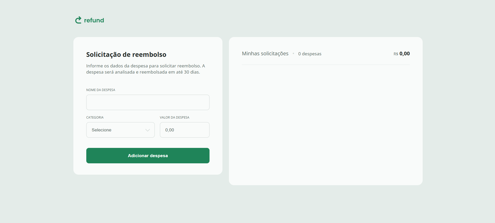

# 💸 Projeto Refund

Aplicação web para solicitação e controle de reembolsos, onde o usuário pode cadastrar despesas informando nome, categoria e valor. O sistema exibe as despesas em uma lista e atualiza o total automaticamente. Ideal para simular um controle simples de gastos.

## 📸 Demonstração

 <!-- Ou use uma imagem .png -->

🔗 Acesse online: [https://raul-dev-br.github.io/Projeto-Refund](https://raul-dev-br.github.io/Projeto-Refund/)

## ✨ Funcionalidades

- Adição de despesas com nome, valor e categoria
- Validação e formatação automática de moeda (R$)
- Exibição do total acumulado
- Remoção de despesas com clique
- Interface responsiva
- Scroll customizado
- Design clean com ícones dinâmicos por categoria

## 🛠️ Tecnologias utilizadas

- HTML5
- CSS3 (Responsividade, variáveis, estilização de scrollbar)
- JavaScript (DOM, eventos, manipulação dinâmica)

## 📦 Como executar

1. Clone o repositório:

```bash
git clone https://github.com/Raul-dev-br/Projeto-Refund.git
